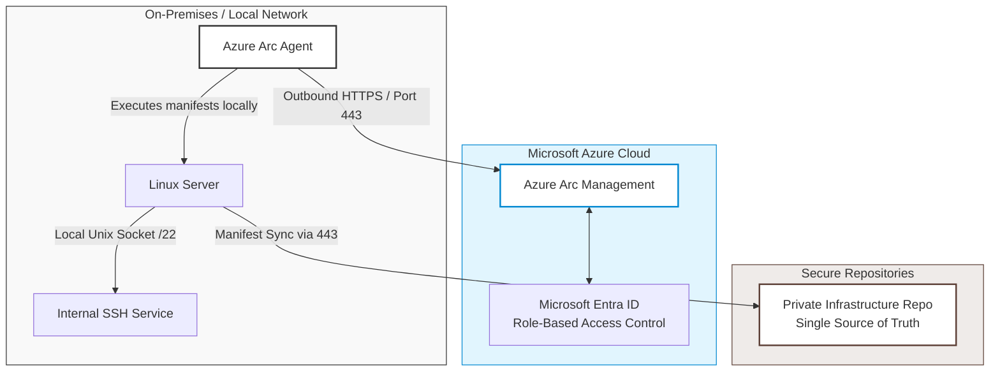

# oszacuj-llm-gitops-enterprise

Secure Hybrid Infrastructure Automation using Azure Arc Flux v2 (GitOps) under Zero Trust Network architecture

# 🚀 Enterprise Hybrid Data Platform: MS Fabric, GitOps & Local LLM Analytics

## 📌 Project Overview
This repository showcases the architectural design, security framework, and ongoing deployment of a production-grade, hybrid analytics platform. The system is designed to ingest and analyze millions of **real estate transaction prices in Poland** using an enterprise data stack. 

The architecture bridges an on-premises **MS SQL Server** engine with **Microsoft Fabric (OneLake)** using the **GitOps (Flux v2)** pattern via **Azure Arc**, creating a secure pipeline for local data crunching and **Private Large Language Model (LLM)** semantic analysis.

> 🔒 **Confidentiality Notice:** In compliance with corporate security standards and non-disclosure practices, the actual source code (automation scripts, sensitive variables, and manifests) resides in a secured, private repository. This public profile serves as an architectural blueprint, project roadmap, and portfolio presentation.

---

## 🏗️ Architectural Framework (Target Architecture)

The entire communication is strictly **outbound-only** via secure TLS tunnels. No inbound firewall modifications or public IP exposures were executed on the local site.

---

## 🛡️ Key Security & Enterprise Features

* **Zero Inbound Ports (No Port 22 Exposed):** The local network perimeter firewall completely blocks incoming traffic. Port 22 (SSH) is strictly bound to the local interface and is unreachable from the public internet.
* **GitOps Pattern (Flux v2):** The private Git repository serves as the *Single Source of Truth*. The Azure Arc Flux extension monitors code changes and automatically reconciles the state of the Linux machine. If configuration drift occurs (e.g., someone accidentally uninstalls Docker), Flux automatically fixes it within minutes.
* **Identity-Driven Management:** Replaced legacy local root credentials with **Microsoft Entra ID (Azure AD) RBAC**. Access is granted dynamically via *Virtual Machine Administrator Login* roles, preventing credential theft.
* **Automated Compliance:** Integrated Azure Governance policies to continuous-audit the machine state and alert on any unapproved local user accounts.

---

## 📅 Project Roadmap & Implementation Phases (Sprint-by-Sprint)

This project is actively developed in iterative sprints. Below is the current status of the implementation:

### 🟢 Phase 1: Hybrid Infrastructure & Security Hardening (COMPLETED)
* [x] **Zero Trust Network Setup:** Configured local Linux server firewall to block all inbound traffic (completely closing public port 22/SSH).
* [x] **Azure Arc Integration:** Successfully registered the hybrid physical machine into Microsoft Azure governance.
* [x] **Identity & Access Management:** Deployed *Microsoft Entra ID based SSH Login* extension and configured Azure RBAC roles (*Virtual Machine Administrator Login*), replacing static credentials.
* [x] **Secure Enterprise Repositories:** Separated code into a hardened Private repository with strict `.gitignore` rules (blocking `.env`, keys, secrets) and configured this Public profile for architectural presentation.

### 🟡 Phase 2: Relational Data Layer & Advanced SQL (IN PROGRESS)
* [ ] **Database Provisioning:** Deploying MS SQL Server 2022 containerized engine on the hybrid machine via GitOps (Flux v2).
* [ ] **Schema Design:** Designing the relational schema for Polish real estate transaction prices (Fact & Dimension tables).
* [ ] **Advanced Analytics:** Implementing heavy-duty SQL features including Window Functions (ranking, moving averages) and Common Table Expressions (CTEs) for market anomaly detection.

### 🔵 Phase 3: Microsoft Fabric & Big Data Ingestion (PLANNED / DP-600)
* [ ] **Data Pipeline Orchestration:** Configure Microsoft Fabric Data Factory to ingest data from on-premises MS SQL to OneLake via secure outbound connectivity.
* [ ] **Medallion Architecture:** Process raw real estate data from Bronze (Raw Delta) to Silver (Cleaned Spark Dataframes) and Gold (Reporting Star-Schema) layers.
* [ ] **DirectLake Optimization:** Build highly performant Power BI semantic models utilizing Fabric's native DirectLake mode.

### 🔵 Phase 4: Local LLMOps & Semantic Analysis (PLANNED)
* [ ] **On-Premises AI Deployment:** Run an insulated Ollama instance hosting open-source models (e.g., Llama 3) via local Docker containers.
* [ ] **Privacy-Preserving Analytics:** Pass real estate statistical anomalies to the local model via Python for automatic narrative generation, ensuring data compliance without third-party cloud exposures.

---

## 🛠️ Tech Stack & Tools
* **Cloud Management:** Azure Arc (Hybrid Compute)
* **GitOps Engine:** Flux v2 (Kustomize)
* **Containerization:** Docker Engine / Docker Compose
* **Operating System:** Linux (Ubuntu/RHEL Enterprise)
* **Data & Fabric:** MS SQL Server 2022, Microsoft Fabric (OneLake), Power BI
* **AI & Language:** Python (Pandas/PySpark), Ollama (Llama 3)

